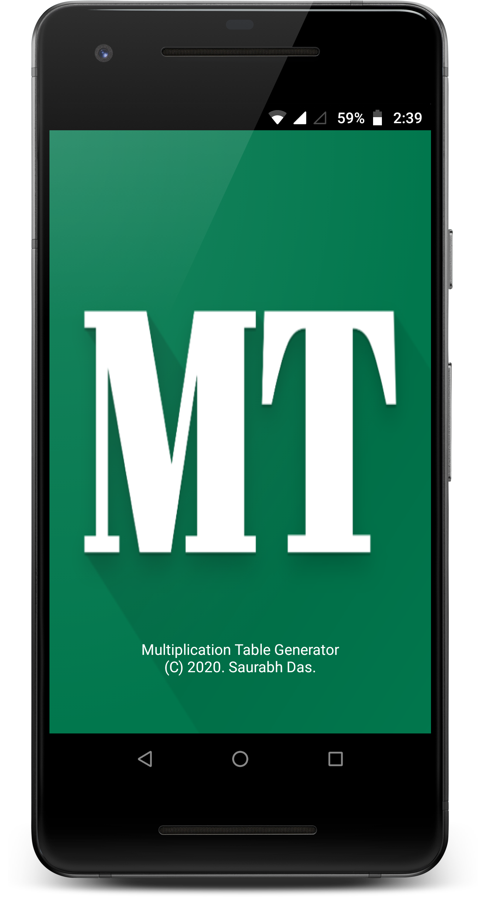
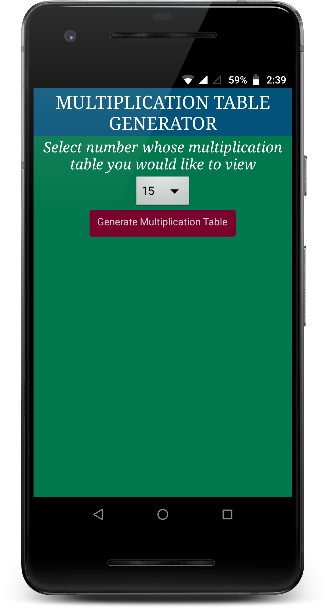
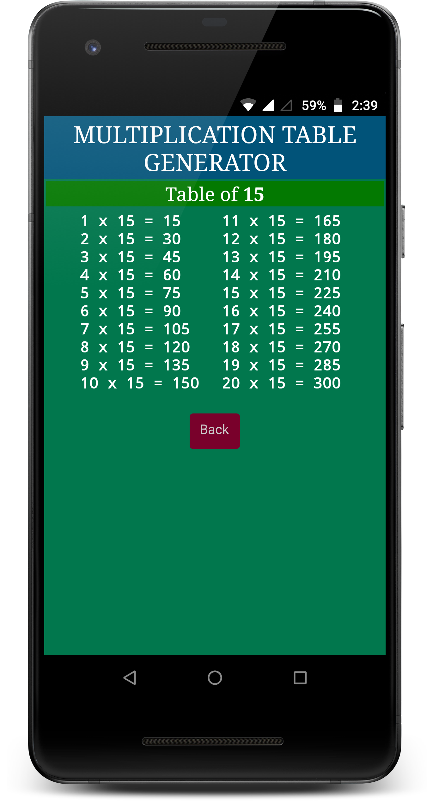
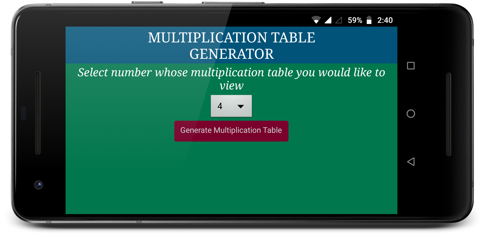
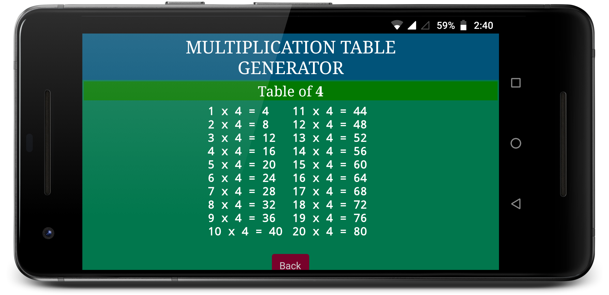

## Multiplication Table Generator - Android-Application
A reference application to generate, view and learn multiplication tables.

## About
* This application is a simple reference educational utility to generate and view Mathematical Multiplication tables.
* The application finds usage in quick reference and memorization.
* The user is able to select and view multiplication tables from 1 to 20.

## Screenshots

### Built With

* Android
* MIT App Inventor

<!-- LICENSE -->
## License

Distributed under the MIT License. See `LICENSE` for more information.

